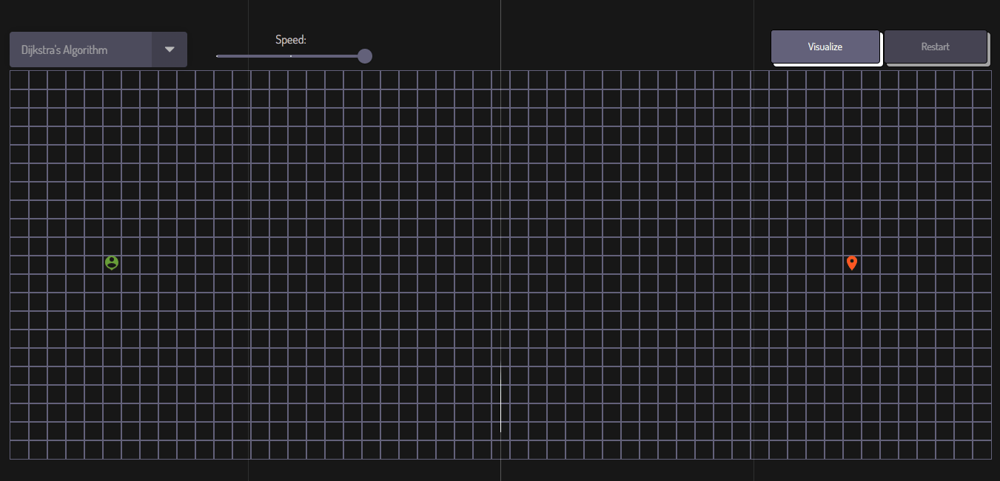

# AlgoVisualizer

AlgoVisualizer is a web application built with React that allows users to visualize various path-finding algorithms to find the shortest path between two points on a grid. It provides an interactive and educational way to understand how these algorithms work.

## Demo 

You can access a live demo of AlgoVisualizer at https://abuuer.github.io/algoVisualizer.

## Features

* Visualize multiple path-finding algorithms.
* Start and finish can be dragged and dropped anywhere on the grid.
* Customize algorithm's speed and obstacle placement.
* Real-time visualization of the algorithm's progress.
* Clear the grid and start a new visualization anytime.

## Usage

1. Open the AlgoVisualizer web application in your browser.
2. Drag and drop the start and finish icons to different cells.
3. Place obstacles on the grid by clicking on the cells. Obstacles represent areas that the algorithm cannot pass through.
4. Choose one of the path-finding algorithms from the dropdown menu.
5. Use the slider to adjust the speed of the algorithm visualization. You can set it to slow down for a more detailed view or speed up for a quicker demonstration.
6. Click the "Visualize" button to start the algorithm. Observe how the algorithm finds the shortest path from the start to the finish icon.
7. To start a new visualization, click the "Restart" button and repeat the process.

## Supported Algorithms

### Dijkstra's Algorithm

Dijkstra's algorithm finds the shortest path by exploring all possible routes from the start point to the finish point, making it suitable for weighted graphs.

### A* Algorithm

The A* algorithm combines the advantages of Dijkstra's algorithm and greedy best-first search. It combines the cost of the path and heuristic value to prioritize nodes that are likely to lead to the shortest path.

### Breadth-First Search (BFS)

Breadth-First Search explores the graph by visiting all neighboring nodes before moving to the next level. It guarantees the shortest path in unweighted graphs.

### Depth-First Search (DFS)

Depth-First Search explores the graph by visiting one branch as deeply as possible before backtracking. It is not guaranteed to find the shortest path.

### Greedy Best-First Search (GBFS)

Greedy Best-First Search is an informed search algorithm that selects the next node based on a heuristic function, typically choosing the node that appears closest to the goal according to the heuristic.

## License

This project is licensed under the MIT License - see the [LICENSE](LICENSE) file for details.
