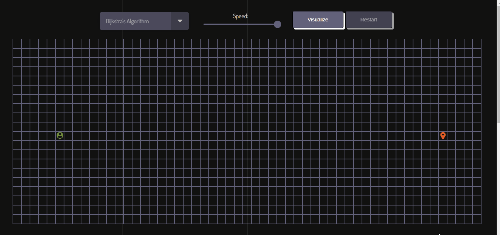
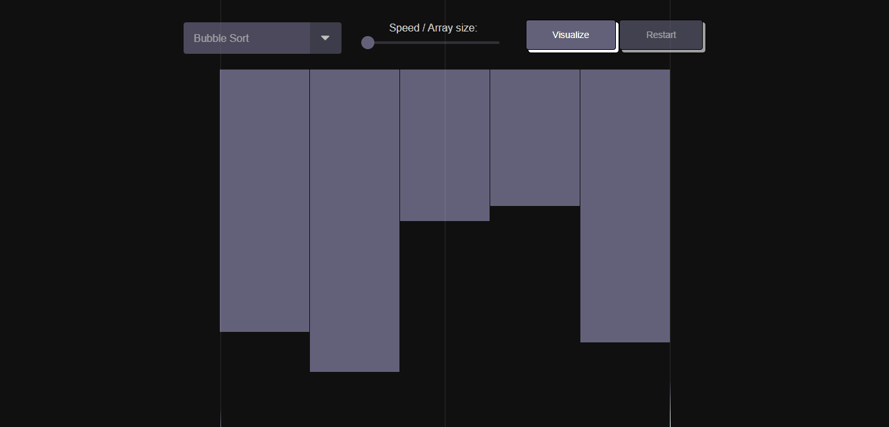

# AlgoVisualizer

AlgoVisualizer is a web application built with React that allows users to visualize various path-finding ans sorting algorithms to better understand their functionality and performance.

## Demo

You can access a live demo of AlgoVisualizer at https://abuuer.github.io/algoVisualizer.

## Features

### Path-Finding Algorithms

- Visualize multiple path-finding algorithms.
- Start and finish can be dragged and dropped anywhere on the grid.
- Customize algorithm's speed and obstacle placement.
- Real-time visualization of the algorithm's progress.
- Clear the grid and start a new visualization anytime.

### Sorting Algorithms

- Visualize multiple sorting algorithms.
- Customize algorithm's speed and array size.
- Real-time visualization of the algorithm's progress.
- Clear the array and start a new visualization anytime.

## Usage

### Path-Finding Algorithms

1. Open the AlgoVisualizer web application in your browser.
2. Drag and drop the start and finish icons to different cells.
3. Place obstacles on the grid by clicking on the cells. Obstacles represent areas that the algorithm cannot pass through.
4. Choose one of the path-finding algorithms from the dropdown menu.
5. Use the slider to adjust the speed of the algorithm visualization. You can set it to slow down for a more detailed view or speed up for a quicker demonstration.
6. Click the "Visualize" button to start the algorithm. Observe how the algorithm finds the shortest path from the start to the finish icon.
7. To start a new visualization, click the "Restart" button and repeat the process.

### Sorting Algorithms

1. Open the AlgoVisualizer web application in your browser.
2. Select the sorting algorithm you want to visualize from the dropdown menu.
3. Use the slider to adjust the array size and the speed of the sorting algorithm visualization.
4. Click the "Visualize" button to start the sorting algorithm. Observe how the algorithm rearranges the elements in the array to achieve a sorted order.
5. To start a new sorting visualization, click the "Restart" button and repeat the process.

## Supported Algorithms

### Path-Finding Algorithms

#### Dijkstra's Algorithm

Dijkstra's algorithm finds the shortest path by exploring all possible routes from the start point to the finish point, making it suitable for weighted graphs.

#### A\* Algorithm

The A\* algorithm combines the advantages of Dijkstra's algorithm and greedy best-first search. It combines the cost of the path and heuristic value to prioritize nodes that are likely to lead to the shortest path.

#### Breadth-First Search (BFS)

Breadth-First Search explores the graph by visiting all neighboring nodes before moving to the next level. It guarantees the shortest path in unweighted graphs.

#### Depth-First Search (DFS)

Depth-First Search explores the graph by visiting one branch as deeply as possible before backtracking. It is not guaranteed to find the shortest path.

#### Greedy Best-First Search (GBFS)

Greedy Best-First Search is an informed search algorithm that selects the next node based on a heuristic function, typically choosing the node that appears closest to the goal according to the heuristic.

### Sorting Algorithms

#### Bubble Sort

Bubble Sort repeatedly steps through the list, compares adjacent elements, and swaps them if they are in the wrong order. It repeats this process until the list is sorted.

#### Quick Sort

Quick Sort is a divide-and-conquer algorithm that partitions the array into smaller sub-arrays, then sorts those sub-arrays. It is known for its efficiency and is widely used in practice.

#### Merge Sort

Merge Sort divides the array into two halves, sorts them separately, and then merges the sorted halves to produce a sorted array. It is a stable sorting algorithm with good performance.

#### Heap Sort

Heap Sort is a comparison-based sorting algorithm that transforms the array into a binary heap and repeatedly removes the maximum element from the heap and adds it to the sorted portion of the array.

#### Selection Sort

Selection Sort repeatedly selects the minimum element from the unsorted portion of the array and places it in the sorted portion. It is simple but not very efficient for large lists.

## License

This project is licensed under the MIT License - see the [LICENSE](LICENSE) file for details.
